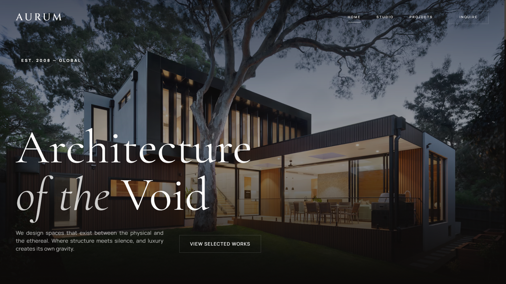

<h1 align="center">⚡ Aurum-Saas</h1>

<p align="center">
  
</p>

<p align="center">
  <strong>A premium, award-winning architectural portfolio template with a Neo-Brutalist aesthetic.</strong>
</p>

<p align="center">
  <a href="#-about">About</a> •
  <a href="#-features">Features</a> •
  <a href="#-design-elements">Design</a> •
  <a href="#%EF%B8%8F-tech-stack">Tech Stack</a> •
  <a href="#-project-structure">Structure</a> •
  <a href="#-getting-started">Get Started</a>
</p>

---

## 📖 About

**Aurum-Saas** is a high-fidelity, visually stunning web application designed for luxury architectural firms and creative agencies. It embodies a **Neo-Brutalist** design philosophy—combining raw, honest aesthetics with premium, modern interactions.

> *"We design spaces that exist between the physical and the ethereal. Where structure meets silence, and luxury creates its own gravity."*

This template is perfect for showcasing portfolios, services, and global operations with an emphasis on immersive user experience and sophisticated design.

---

## ✨ Features

| Feature | Description |
| :--- | :--- |
| 🏠 **Multi-Page Architecture** | Includes a stunning Landing Page, an About Page, and a Projects Showcase. |
| 🎨 **Neo-Brutalist UI** | A bold, raw aesthetic with smooth, modern typographic treatments. |
| 🌍 **Global Presence Section** | An interactive map with live timezone clocks for global offices. |
| 💬 **Interactive FAQ Accordion** | Expandable FAQ section with silky-smooth animations. |
| 🔄 **Dynamic Marquee** | A scrolling text banner to highlight key brand messages. |
| 🖼️ **Hover-Driven Interactivity** | Services and material sections reveal content on hover. |
| 📱 **Fully Responsive** | Pixel-perfect on all devices, from mobile to 4K displays. |
| ⚡ **Lightning-Fast Performance** | Built with Vite for instant HMR and blazing-fast builds. |

---

## 🎨 Design Elements

The design system is meticulously crafted to evoke a sense of **timeless luxury**.

### 🖋️ Typography

Aurum uses a curated selection of premium fonts for a distinct visual identity:

-   **`Cinzel`**: A classic, display serif for impactful headings.
-   **`Cormorant Garamond`**: An elegant, high-contrast serif for body quotes and emphasis.
-   **`Manrope`**: A clean, geometric sans-serif for UI elements and body text.

### 🎨 Color Palette

The palette is based on sophisticated **"Stone"** tones, creating a warm, neutral foundation with high-contrast accents.

| Color | Hex | Usage |
| :---: | :--- | :--- |
|  | `#fafaf9` | `stone-50` - Light Backgrounds |
|  | `#f5f5f4` | `stone-100` - Muted Backgrounds |
|  | `#1c1917` | `stone-900` - Dark Text & UI |
|  | `#0c0a09` | `stone-950` - Primary Dark Background |

### 🎬 Animations

Custom, high-fidelity animations are defined in `tailwind.config.js` to bring the UI to life:

-   **`animate-marquee`**: Infinite horizontal scrolling for the text marquee.
-   **`animate-fade-in-up`**: Smooth entrance animation for hero elements.
-   **`animate-reveal`**: A clip-path animation for dramatic content reveals.
-   **`animate-zoom-slow`**: A subtle, continuous zoom effect for hero images.

---

## 🛠️ Tech Stack

This project leverages a modern, robust, and developer-friendly technology stack.

<p align="center">
  
</p>

| Technology | Role |
| :--- | :--- |
| **[React](https://react.dev/)** | Component-based UI library for building interactive interfaces. |
| **[TypeScript](https://www.typescriptlang.org/)** | Superset of JavaScript for type-safe code and better DX. |
| **[Tailwind CSS](https://tailwindcss.com/)** | Utility-first CSS framework for rapid, custom styling. |
| **[Vite](https://vitejs.dev/)** | Next-generation frontend tooling for fast development. |
| **[React Router](https://reactrouter.com/)** | Declarative routing for multi-page navigation. |
| **[Lucide React](https://lucide.dev/)** | Beautiful, consistent, and customizable SVG icons. |
| **[ESLint](https://eslint.org/)** | Code linting for consistent code quality. |

---

## 📂 Project Structure

A clean, scalable, and modular file architecture.

```
📁 Aurum-Saas/
├── 📁 public/
│   └── 🖼️ Thumbnail.png           # Project Thumbnail for README
├── 📁 src/
│   ├── 📁 components/             # Reusable UI Components
│   │   ├── 📄 Accordion.tsx       # Expandable FAQ Component
│   │   ├── 📄 Button.tsx          # Custom Button Component
│   │   ├── 📄 Footer.tsx          # Site Footer
│   │   ├── 📄 Marquee.tsx         # Scrolling Text Marquee
│   │   └── 📄 Navbar.tsx          # Navigation Bar
│   ├── 📁 pages/                  # Page-Level Components
│   │   ├── 📄 AboutPage.tsx       # About Us Page
│   │   ├── 📄 LandingPage.tsx     # Main Hero & Sections
│   │   └── 📄 ProjectsPage.tsx    # Projects Showcase Page
│   ├── 📄 App.tsx                 # Main App Entry & Routing
│   ├── 📄 index.css               # Global Styles & Tailwind Directives
│   ├── 📄 main.tsx                # React DOM Entry Point
│   └── 📄 types.ts                # Shared TypeScript Interfaces
├── 📄 .gitignore                  # Files Ignored by Git
├── 📄 eslint.config.js            # ESLint Configuration
├── 📄 index.html                  # Main HTML Entry Point
├── 📄 package.json                # Project Dependencies & Scripts
├── 📄 postcss.config.js           # PostCSS Configuration
├── 📄 tailwind.config.js          # Tailwind CSS Configuration
├── 📄 tsconfig.json               # TypeScript Configuration
└── 📄 vite.config.ts              # Vite Bundler Configuration
```

---

## 🏁 Getting Started

Follow these steps to get Aurum-Saas running on your local machine.

### 📋 Prerequisites

-   [Node.js](https://nodejs.org/) `v18` or higher
-   [npm](https://www.npmjs.com/) or [yarn](https://yarnpkg.com/)

### ⚙️ Installation

1.  **Clone the repository:**
    ```bash
    git clone https://github.com/panduthegang/Aurum-Saas.git
    ```

2.  **Navigate to the project directory:**
    ```bash
    cd Aurum-Saas
    ```

3.  **Install the dependencies:**
    ```bash
    npm install
    ```

4.  **Start the development server:**
    ```bash
    npm run dev
    ```
    Open your browser and navigate to `http://localhost:5173` 🎉

---

## 📜 Available Scripts

| Command | Description |
| :--- | :--- |
| `npm run dev` | 🚀 Starts the Vite development server with HMR. |
| `npm run build` | 📦 Builds the app for production in the `dist/` folder. |
| `npm run preview` | 👀 Previews the production build locally. |
| `npm run lint` | 🔍 Runs ESLint to analyze code for potential errors. |

---

## 🤝 Contributing

Contributions are what make the open-source community such an amazing place. Any contributions you make are **greatly appreciated**.

1.  🍴 **Fork** the Project
2.  🌿 Create your **Feature Branch** (`git checkout -b feature/AmazingFeature`)
3.  💾 **Commit** your Changes (`git commit -m 'Add some AmazingFeature'`)
4.  🚀 **Push** to the Branch (`git push origin feature/AmazingFeature`)
5.  📬 Open a **Pull Request**

---

## 📄 License

Distributed under the **MIT License**. See `LICENSE` for more information.

---

<p align="center">
  <br />
  Made with ❤️ and a relentless pursuit of <strong>perfection</strong>.
  <br />
  <a href="https://github.com/panduthegang">
    <strong>@panduthegang</strong>
  </a>
</p>
